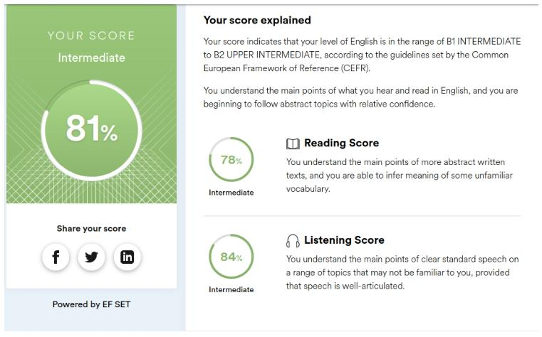

# Eugene Gladkov 

 

## Contact 
   * E-mail: eugvok@gmail.com 
   * Discord: Jožin (@Jozin-z-baziny) 

## About Me 
   * Interested in web development. I expect to eventually master the full stack, but I see the frontend as the main direction. 
      + Negotiations
      + Stress resistance
      + Time management
      + Teamwork 

## Skills:
   * PC-user (Win/Lin)
   * MsWorld & Excel
   * HTML (basics)
   * CSS (basics)
   * JS (basics) 

## Code example: 
### Your task is to write a function maskify, which changes all but the last four characters into '#'. 
   ``` 
      // return masked string
      function maskify(cc) {
         if (cc.length <=4) {
            return cc;
         } else {
            return ("#".repeat((cc.length-4))+cc.slice(-4, cc.length));
         }
      }
   ``` 

## My works: 
### [VOS](https://sergey962.github.io/Dolgodrudniy_VOS/ "society of the blind landing page") 

## Education: 
### 2003-2005 BMSTU mechanical engineering technologies (not completed) 
* [Web development for beginners: HTML & CSS](https://stepik.org/cert/578771 "stepic free courses") 
* [JavaScript for beginners](https://stepik.org/cert/1237986 "stepic free courses") 

## English 
 